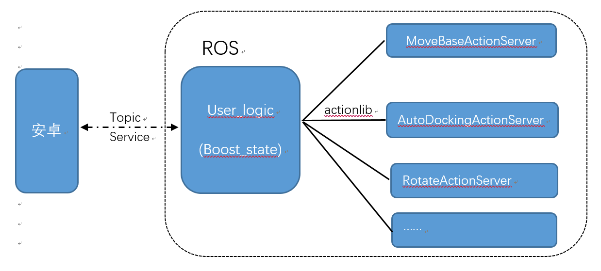
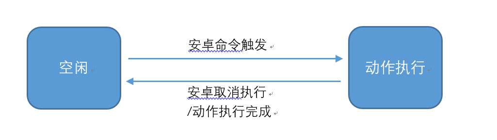

# User_Logic_Node

该节点主要用于用户运动功能的逻辑处理，与安卓端的运动功能交互，运动状态反馈等。

## 主要依赖库

[The Boost Statechart Library](https://www.boost.org/doc/libs/1_45_0/libs/statechart/doc/tutorial.html)

## 执行流程

收到用户端指令后，user_logic_node节点通过actionlib机制调用对应的ActionServer出发动作执行，同时对外实时发布当前状态。

机器人所有状态切换均由**空闲**状态转移，动作执行完成后或者被取消后，机器人再次进入**空闲**状态

## 功能列表

action id| 对应ActionServer名称| 描述
--|--|--
"idle"| [IdleActionServer]() | 空闲状态处理
"sleep" | [SleepActionServer]() | 休眠状态处理
"movebase_goal" | [MoveBaseActionServer]() | 导航到目标点
"rotate" | [RotateActionServer]() | 旋转一定角度(body 系)
"rotate_to" | [RotateActionServer]() | 旋转到指定朝向(world 系) 
"go_charging" | [AutoDockingActionServer]() | 返回充电
"separate_docker" | [AutoDockingActionServer]() | 脱离充电桩
"remote_telep" | [RemoteTelepActionServer]() | 远程遥控，遇到障碍物停止
